#  AIAS - AI Assistant System

<div align="center">


[](https://python.org)
[](https://groq.com)
[](LICENSE)
[](https://www.microsoft.com/windows)

**A 24/7 screen-aware AI assistant for Windows with persistent memory and fast responses**

[Features](#-features)  [Screenshots](#-screenshots)  [Installation](#-installation)  [Usage](#-usage)  [Memory System](#-memory-system)

</div>

---

##  Features

| Feature | Description |
|---------|-------------|
|  **Screen-Aware** | Sees and understands your screen in real-time |
|  **Fast Responses** | Powered by Groq API with Llama 4 Scout (~3-5s response time) |
|  **Persistent Memory** | Remembers your info across sessions (name, contacts, preferences) |
|  **Voice Input** | Optional voice commands with OpenWakeWord + Whisper |
|  **Interactive Overlay** | Beautiful always-on-top chat interface |
|  **Copy Support** | Select and copy AI responses easily |
|  **Privacy-First** | Screen processing happens locally, only text goes to API |

---

##  Screenshots

<div align="center">

### Main Interface


*Clean, modern overlay that stays on top of your windows*

### Chat & Screen Analysis


*Ask questions about what is on your screen*

### Memory & Facts


*AIAS learns and remembers information about you*

### Saved Preferences


*Quick access to your saved URLs and preferences*

</div>

---

##  Installation

### Prerequisites
- **OS**: Windows 10/11
- **Python**: 3.10+
- **Groq API Key**: [Get free key here](https://console.groq.com/keys)

### Quick Setup

```bash
# 1. Clone the repository
git clone https://github.com/yourusername/AIAS.git
cd AIAS

# 2. Create virtual environment
python -m venv venv
venv\Scripts\activate

# 3. Install dependencies
pip install -r requirements.txt

# 4. Set up environment
copy .env.example .env
# Edit .env and add your GROQ_API_KEY
```

### Environment Variables

Create a `.env` file:
```env
GROQ_API_KEY=your_groq_api_key_here
```

---

##  Usage

### Start AIAS

```bash
# Lite mode (recommended - keyboard input)
python main.py --lite

# Full mode (with voice input)
python main.py

# Diagnostics
python main.py --diagnostics
```

### Chat Commands

| Command | Description |
|---------|-------------|
| Type any question | Ask about your screen |
| `show facts` | See what AIAS remembers |
| `show urls` | View saved URLs/preferences |
| `what do you know about me` | Full profile view |
| `clear my memory` | Reset all memory |

### Memory Commands

Tell AIAS to remember things explicitly:
```
remember that my project deadline is Dec 25
remember my github is https://github.com/username
note that I prefer dark mode
```

---

##  Memory System

AIAS has a persistent memory that learns about you:

### What It Stores
- **Profile**: Name, occupation, location
- **Contacts**: Friends, family, colleagues
- **Preferences**: URLs, settings, custom facts
- **Conversation History**: Last 500 interactions

### Storage Location
```
memory/
 user_profile.json    # Your personal info
 memories.json        # Conversation history
 learned_facts.json   # Extracted facts
```

### Auto-Detection
AIAS automatically extracts info from phrases like:
- "My name is..."  Saves name
- "I work as..."  Saves occupation
- "I like..."  Saves interests
- URLs with context  Saves to preferences

### Manual Editing
You can directly edit the JSON files in the `memory/` folder anytime!

---

##  Configuration

Edit `config.yaml`:

```yaml
llm:
  provider: "groq"  # or "local" for Qwen2-VL
  model:
    name: "meta-llama/llama-4-scout-17b-16e-instruct"
  generation:
    max_new_tokens: 512
    temperature: 0.7

screen:
  capture:
    interval_seconds: 2.0
    max_buffer_size: 5
  processing:
    max_width: 1280
    jpeg_quality: 85

overlay:
  window:
    position: "bottom-right"  # bottom-left, top-right, top-left, center
```

---

## 🏗️ Architecture

```mermaid
flowchart TB
    subgraph Input["📥 Input Layer"]
        KB[⌨️ Keyboard]
        MIC[🎤 Microphone]
        SCR[🖥️ Screen Capture]
    end

    subgraph Core["⚙️ Core System"]
        ORCH[🎯 Orchestrator]
        MEM[(🧠 Memory System)]
    end

    subgraph Processing["🔄 Processing"]
        STT[🗣️ Speech-to-Text<br/>Whisper]
        VIS[👁️ Vision Analysis<br/>Screenshot → Base64]
    end

    subgraph LLM["🤖 AI Engine"]
        GROQ[⚡ Groq API<br/>Llama 4 Scout]
    end

    subgraph Output["📤 Output"]
        OVR[💬 Overlay Window]
        LOG[📝 Logs]
    end

    subgraph Storage["💾 Persistent Storage"]
        PROF[👤 user_profile.json]
        FACTS[📋 learned_facts.json]
        HIST[💭 memories.json]
    end

    KB --> ORCH
    MIC --> STT --> ORCH
    SCR --> VIS --> ORCH
    
    ORCH <--> MEM
    ORCH --> GROQ
    GROQ --> ORCH
    
    MEM <--> PROF
    MEM <--> FACTS
    MEM <--> HIST
    
    ORCH --> OVR
    ORCH --> LOG

    style Input fill:#1a1a2e,stroke:#00d4aa,color:#fff
    style Core fill:#16213e,stroke:#4a9eff,color:#fff
    style Processing fill:#1a1a2e,stroke:#f39c12,color:#fff
    style LLM fill:#0f3460,stroke:#e94560,color:#fff
    style Output fill:#1a1a2e,stroke:#00d4aa,color:#fff
    style Storage fill:#16213e,stroke:#9b59b6,color:#fff
```



### Data Flow

```mermaid
sequenceDiagram
    participant U as 👤 User
    participant O as 💬 Overlay
    participant C as ⚙️ Orchestrator
    participant S as 🖥️ Screen
    participant M as 🧠 Memory
    participant G as ⚡ Groq API

    U->>O: Type question
    O->>C: Send query
    C->>S: Capture screenshot
    S-->>C: Base64 image
    C->>M: Get context
    M-->>C: Profile + history
    C->>G: Query + Image + Context
    G-->>C: AI Response
    C->>M: Extract & save facts
    C->>O: Display response
    O->>U: Show answer
```



---

##  Project Structure

```
AIAS/
 main.py              # Entry point
 config.yaml          # Configuration
 requirements.txt     # Dependencies
 .env                 # API keys (not in git)
 aias/
    orchestrator.py  # Main coordinator
    overlay.py       # Tkinter UI
    screen.py        # Screenshot capture
    groq_llm.py      # Groq API integration
    memory.py        # Persistent memory
    audio.py         # Voice input (optional)
    logger.py        # Logging system
 memory/              # Persistent storage
 logs/                # Query logs & screenshots
 screenshots/         # README images
```

---

##  Troubleshooting

### "Groq API Error"
- Check your `GROQ_API_KEY` in `.env`
- Verify key at [console.groq.com](https://console.groq.com)

### Slow Responses
- Groq should respond in 3-5 seconds
- Check internet connection
- Try reducing `max_new_tokens` in config

### Memory Not Saving
- Check `memory/` folder permissions
- Try explicit commands: "remember that..."

### Overlay Not Showing
- Check if another fullscreen app is blocking
- Try different `position` in config

---

##  Roadmap

- [ ] Multi-monitor support
- [ ] Custom wake word training
- [ ] Plugin system for extensions
- [ ] Cross-platform (Linux/Mac)
- [ ] Local LLM fallback option

---

##  License

MIT License - See [LICENSE](LICENSE) for details.

---

##  Acknowledgments

- [Groq](https://groq.com) - Lightning-fast LLM inference
- [Llama 4 Scout](https://ai.meta.com) - Vision-language model
- [OpenWakeWord](https://github.com/dscripka/openWakeWord) - Open source wake word detection
- [MSS](https://github.com/BoboTiG/python-mss) - Fast screenshot capture

---

<div align="center">

**Made with  by [Adarsh Kesharwani](https://adarshhme.vercel.app/)**

[](https://adarshhme.vercel.app/)
[](https://github.com/yourusername)

</div>
